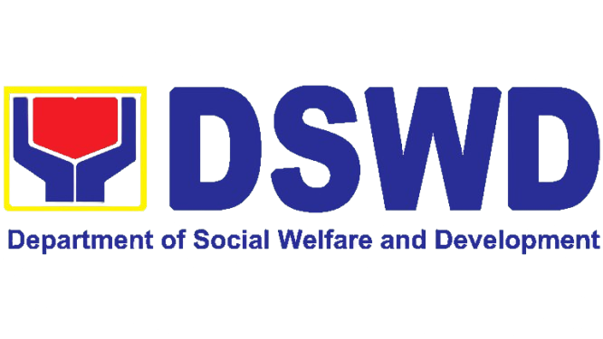

# ELDERA IMS - Elderly Information Management System

<div align="center">
  
  
  
</div>

<div align="center">
  <h3>🏛️ Department of Social Welfare and Development</h3>
  <h3>👴👵 Social Pension for Indigent Senior Citizens</h3>
  <h3>🇵🇭 Bagong Pilipinas Initiative</h3>
</div>

---

## 📋 Table of Contents

- [Overview](#overview)
- [Features](#features)
- [Technology Stack](#technology-stack)
- [Installation](#installation)
- [Configuration](#configuration)
- [Database Schema](#database-schema)
- [API Documentation](#api-documentation)
- [Usage Guide](#usage-guide)
- [Development](#development)
- [Testing](#testing)
- [Deployment](#deployment)
- [Contributing](#contributing)
- [License](#license)

---

## 🎯 Overview

**ELDERA IMS** (Elderly Information Management System) is a comprehensive web application designed to manage senior citizen information, applications, and services for the Department of Social Welfare and Development (DSWD). The system facilitates the administration of social pension programs and benefits for indigent senior citizens in the Philippines.

### 🎯 Key Objectives

- **Digital Transformation**: Modernize senior citizen data management
- **Efficiency**: Streamline application processes for social pension and benefits
- **Transparency**: Provide clear tracking of application statuses
- **Accessibility**: Ensure easy access for government staff and administrators
- **Compliance**: Meet DSWD requirements and regulations

---

## ✨ Features

### 👥 Senior Citizen Management
- **Comprehensive Profiles**: Complete demographic, health, and economic information
- **OSCA ID Management**: Unique identification system for senior citizens
- **Status Tracking**: Active/Deceased status management
- **Barangay-based Organization**: Geographic organization by barangay

### 📋 Application Management
- **Senior ID Applications**: Digital ID card applications
- **Social Pension Applications**: Monthly pension benefit applications
- **Benefits Applications**: Medical, burial, and financial assistance
- **Status Workflow**: Pending → Under Review → Approved/Rejected → Completed

### 📊 Dashboard & Analytics
- **Real-time Statistics**: Age groups, barangay distribution, application statuses
- **Interactive Charts**: Visual representation of data trends
- **Barangay-specific Views**: Filtered data by geographic location
- **Performance Metrics**: Application processing times and success rates

### 🔐 Authentication & Security
- **Multi-factor Authentication**: Email verification with 6-digit codes
- **Google OAuth Integration**: Social login capabilities
- **Role-based Access**: Admin and user permission levels
- **Secure File Uploads**: Document management with validation

### 📱 User Experience
- **Responsive Design**: Mobile-friendly interface
- **Confirmation Dialogs**: User-friendly confirmation for critical actions
- **Real-time Notifications**: Success/error message system
- **Form Validation**: Client and server-side validation

### 📄 Document Management
- **File Upload System**: Photos, ID documents, supporting documents
- **Document Validation**: File type and size restrictions
- **Thumbnail Generation**: Automatic image optimization
- **Secure Storage**: Protected file access

---

## 🛠️ Technology Stack

### Backend
- **Laravel 12.x**: PHP web application framework
- **PHP 8.2+**: Modern PHP with enhanced performance
- **PostgreSQL**: Robust relational database
- **Laravel Sanctum**: API authentication
- **Laravel Socialite**: OAuth integration

### Frontend
- **Blade Templates**: Laravel's templating engine
- **Bootstrap 5**: Responsive CSS framework
- **Tailwind CSS 4.0**: Utility-first CSS framework
- **JavaScript ES6+**: Modern JavaScript features
- **Vite**: Fast build tool and development server

### Development Tools
- **Composer**: PHP dependency management
- **NPM**: Node.js package management
- **Pest**: Modern PHP testing framework
- **Laravel Pint**: Code style fixer
- **Laravel Sail**: Docker development environment

---

## 🚀 Installation

### Prerequisites

- **PHP 8.2 or higher**
- **Composer**
- **PostgreSQL 12+**
- **Node.js 18+**
- **NPM**

### Step-by-Step Installation

1. **Clone the Repository**
   ```bash
   git clone <repository-url>
   cd ELDERA_IMS
   ```

2. **Install PHP Dependencies**
   ```bash
   composer install
   ```

3. **Install Node Dependencies**
   ```bash
   npm install
   ```

4. **Environment Configuration**
   ```bash
   cp .env.example .env
   php artisan key:generate
   ```

5. **Database Setup**
   ```bash
   # Update .env with your database credentials
   DB_CONNECTION=pgsql
   DB_HOST=127.0.0.1
   DB_PORT=5432
   DB_DATABASE=eldera_ims
   DB_USERNAME=your_username
   DB_PASSWORD=your_password
   ```

6. **Run Migrations**
   ```bash
   php artisan migrate
   ```

7. **Seed Database**
   ```bash
   php artisan db:seed
   ```

8. **Build Assets**
   ```bash
   npm run build
   ```

9. **Start Development Server**
   ```bash
   php artisan serve
   ```

---

## ⚙️ Configuration

### Application Settings

The application configuration is managed through `config/eldera.php`:

```php
'seniors' => [
    'min_age' => 60,
    'osca_id_prefix' => 'OSCA',
    'auto_generate_osca_id' => true,
    'default_status' => 'active',
    'pension_eligibility_age' => 60,
    'pension_eligibility_income' => 5000,
],

'applications' => [
    'statuses' => [
        'pending' => 'Pending',
        'under_review' => 'Under Review',
        'approved' => 'Approved',
        'rejected' => 'Rejected',
        'completed' => 'Completed',
    ],
    'types' => [
        'senior_id' => 'Senior ID Application',
        'pension' => 'Pension Application',
        'benefits' => 'Benefits Application',
    ],
],
```

### File Upload Configuration

```php
'file_uploads' => [
    'max_size' => 2048, // KB
    'allowed_mime_types' => [
        'image/jpeg',
        'image/png',
        'image/jpg',
        'application/pdf',
    ],
    'storage_disk' => 'public',
    'generate_thumbnails' => true,
],
```

---

## 🗄️ Database Schema

### Core Tables

#### `seniors`
- **Primary Key**: `id`
- **Unique Identifier**: `osca_id`
- **Personal Information**: `first_name`, `last_name`, `middle_name`, `date_of_birth`
- **Contact Details**: `contact_number`, `email`, `barangay`
- **Status**: `status` (active/deceased)
- **Comprehensive Fields**: Health, economic, family composition data

#### `applications`
- **Primary Key**: `id`
- **Foreign Key**: `senior_id` → `seniors.id`
- **Application Type**: `senior_id`, `pension`, `benefits`
- **Status Workflow**: `pending`, `under_review`, `approved`, `rejected`, `completed`
- **Metadata**: JSON field for additional data

#### `pension_applications`
- **Foreign Key**: `application_id` → `applications.id`
- **Financial Data**: `monthly_income`, `pension_amount`
- **Pension Details**: `has_pension`, `pension_source`

#### `benefits_applications`
- **Foreign Key**: `application_id` → `applications.id`
- **Benefit Type**: `medical`, `burial`, `financial`, `others`
- **Milestone Age**: `milestone_age` (80, 85, 90, 95, 100)

#### `senior_id_applications`
- **Foreign Key**: `application_id` → `applications.id`
- **ID Details**: `full_name`, `address`, `occupation`
- **Government IDs**: `ctc_number`, `place_of_issuance`

### Relationships

```php
Senior::hasMany(Application::class)
Application::belongsTo(Senior::class)
Application::hasOne(PensionApplication::class)
Application::hasOne(BenefitsApplication::class)
Application::hasOne(SeniorIdApplication::class)
```

---

## 📚 API Documentation

### Authentication Endpoints

```http
POST /Login
POST /Signup
POST /verify-code
GET /auth/google
GET /auth/google/callback
```

### Senior Management

```http
GET /Seniors                    # List all seniors
POST /seniors                   # Create new senior
GET /View_senior/{id}          # View senior details
GET /Edit_senior/{id}          # Edit senior form
PUT /Edit_senior/{id}          # Update senior
DELETE /Delete_senior/{id}     # Delete senior
```

### Application Management

```http
GET /Seniors/benefits           # Benefits applications
GET /Seniors/pension           # Pension applications
GET /Seniors/id-applications   # Senior ID applications
POST /Form_pension             # Submit pension application
POST /Form_existing_senior     # Submit benefits application
POST /Form_seniorID            # Submit senior ID application
```

### Dashboard & Analytics

```http
GET /api/barangay-stats/{barangay}  # Barangay-specific statistics
GET /test-api/{barangay}            # Test API endpoint
```

---

## 📖 Usage Guide

### For Administrators

1. **Dashboard Access**
   - Navigate to `/` for the main dashboard
   - View real-time statistics and charts
   - Filter data by barangay

2. **Senior Management**
   - Access `/Seniors` to view all senior citizens
   - Use filters to find specific seniors
   - Edit senior profiles as needed

3. **Application Processing**
   - Review applications in respective sections
   - Update application statuses
   - Process approved applications

### For Users

1. **Creating Applications**
   - Navigate to appropriate form (`/Form_pension`, `/Form_existing_senior`, `/Form_seniorID`)
   - Fill out required information
   - Upload supporting documents
   - Submit for review

2. **Tracking Applications**
   - Check application status in respective tables
   - View application details
   - Receive notifications for updates

### Form Features

- **Auto-fill Functionality**: Senior data automatically populates forms
- **Validation**: Real-time form validation
- **Confirmation Dialogs**: "Are you sure?" confirmations for critical actions
- **File Uploads**: Drag-and-drop document uploads
- **Responsive Design**: Works on all device sizes

---

## 🔧 Development

### Development Environment

```bash
# Start development server with hot reload
npm run dev

# Run Laravel development server
php artisan serve

# Run queue worker
php artisan queue:work

# Watch for file changes
npm run watch
```

### Code Style

```bash
# Fix code style issues
php artisan pint

# Run tests
php artisan test

# Generate test coverage
php artisan test --coverage
```

### Database Management

```bash
# Create new migration
php artisan make:migration create_table_name

# Run migrations
php artisan migrate

# Rollback migrations
php artisan migrate:rollback

# Seed database
php artisan db:seed

# Fresh migration with seeding
php artisan migrate:fresh --seed
```

---

## 🧪 Testing

### Running Tests

```bash
# Run all tests
php artisan test

# Run specific test suite
php artisan test --testsuite=Feature

# Run with coverage
php artisan test --coverage

# Run specific test
php artisan test --filter=SeniorControllerTest
```

### Test Structure

```
tests/
├── Feature/
│   ├── SeniorManagementTest.php
│   ├── ApplicationTest.php
│   └── AuthenticationTest.php
└── Unit/
    ├── SeniorModelTest.php
    └── ApplicationServiceTest.php
```

---

## 🚀 Deployment

### Production Setup

1. **Environment Configuration**
   ```bash
   # Set production environment
   APP_ENV=production
   APP_DEBUG=false
   
   # Configure database
   DB_CONNECTION=pgsql
   DB_HOST=your-production-host
   DB_DATABASE=eldera_ims_prod
   ```

2. **Optimize Application**
   ```bash
   # Cache configuration
   php artisan config:cache
   
   # Cache routes
   php artisan route:cache
   
   # Cache views
   php artisan view:cache
   
   # Optimize autoloader
   composer install --optimize-autoloader --no-dev
   ```

3. **Build Assets**
   ```bash
   npm run build
   ```

4. **Database Migration**
   ```bash
   php artisan migrate --force
   ```

### Server Requirements

- **PHP 8.2+** with extensions: BCMath, Ctype, Fileinfo, JSON, Mbstring, OpenSSL, PDO, Tokenizer, XML
- **PostgreSQL 12+**
- **Web Server**: Apache/Nginx
- **SSL Certificate** (recommended)

---

## 🤝 Contributing

### Development Workflow

1. **Fork the Repository**
2. **Create Feature Branch**: `git checkout -b feature/new-feature`
3. **Make Changes**: Follow coding standards
4. **Run Tests**: Ensure all tests pass
5. **Commit Changes**: Use descriptive commit messages
6. **Push to Branch**: `git push origin feature/new-feature`
7. **Create Pull Request**: Provide detailed description

### Coding Standards

- Follow **PSR-12** coding standards
- Use **Laravel conventions**
- Write **comprehensive tests**
- Document **new features**
- Update **README** as needed

---

## 📄 License

This project is licensed under the **MIT License** - see the [LICENSE](LICENSE) file for details.

---

## 📞 Support

For support and questions:

- **Email**: [support@eldera-ims.com](mailto:support@eldera-ims.com)
- **Documentation**: [docs.eldera-ims.com](https://docs.eldera-ims.com)
- **Issues**: [GitHub Issues](https://github.com/your-org/eldera-ims/issues)

---

## 🙏 Acknowledgments

- **Department of Social Welfare and Development (DSWD)**
- **Laravel Framework** for the robust foundation
- **Bootstrap** for responsive design components
- **PostgreSQL** for reliable data storage
- **Open Source Community** for continuous improvement

---

<div align="center">
  <p><strong>ELDERA IMS</strong> - Empowering Senior Citizens Through Technology</p>
  <p>Built with ❤️ for the Filipino Senior Citizens</p>
</div>
